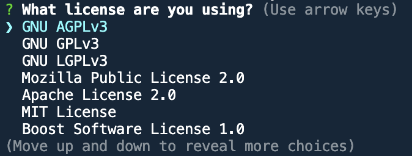

# README-generator

## Description

Given some initial code, I have created a command line application that when run, will generate a README based on the users answers to questions that are generated on the command line. The questions follow the [Professional README guide](https://coding-boot-camp.github.io/full-stack/github/professional-readme-guide) principles to ensure that a high-quality and professional README will be generated.

## Installation

This application uses node.js to run. Please make sure you have it installed before trying to run the application. You can find a link to node.js [here](https://nodejs.org/en).

This application uses the Inquirer package as a way to display the questions to the user. The package is already installed and included in the dependencies in the package.json file. However if you run into issues you may wish to install the package again. To do so:
1. Right click the index.js file and click 'open in integrated terminal' or if you code editor does not have this function then you can use your terminal and make sure you are giving it the right file path.
2. Once you have navigated your way there, type "npm init -y" to initialise npm
3. Then type in "npm install inquirer@8.2.4" to install the Inquirer package.
Now you should be able to run this application.

## Usage

Once you have opened up the terminal to the path corresponding to the application (see installation section for how to do this), type "node index.js" and press enter to run the application.

You will then be prompted with several questions to answer.

Please be as thorough as possible when answering these questions, as a high-quality and professional README is imperative to any project. 
When you come across the question about what license you have used, please note that this is a list that you can scroll down with the up and down arrow. Press enter when you are on the licence you want.

Once all questions are answered you will see a message in the terminal "README file successfully created!" to indicate that the file creation has been successful. If there has been an issue an error message will appear.

You can then click on README.md file generated to view it. 

The generated REAME will looks something like this:

You will see your project name at the top of the page, along with a badge for the license you have selected (NOTE: if you have selected none for license there will be no badge).

You will then see a table of contents, where you can click on any section to bring you directly there. 

All of the information that you can provided will be placed within its respective sections within the README.

If you have chosen a license, then in the license section you will find the name of your license, a little information about it, and a link to the license if you wish to know any more information.

There is a questions section at the bottom that steers viewers to your Github page if they have any questions, and your email address if they have further question still.

A video of the usage of this appication can be found [here](https://drive.google.com/file/d/1XgPNwV2SninCCZhtAPIbq6unYCKLjNkw/view).

## Credits

The questions to ask came from: https://coding-boot-camp.github.io/full-stack/github/professional-readme-guide
